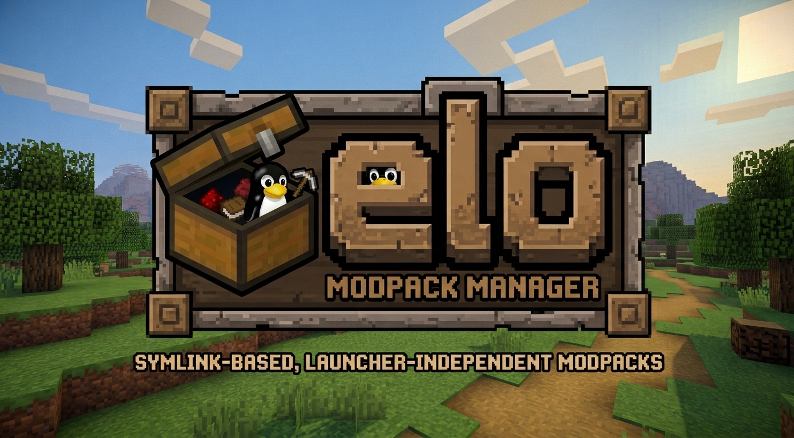

<div align="center">
  

  <h1>Elo</h1>

  <p>
    A terminal application for organizing Minecraft mods, resource packs,
    shaders, and configuration into separate instances.
  </p>

  <p>
    Launcher-independent · Interactive when you want guidance · Scriptable
    when you want speed
  </p>
</div>

```bash
elo                               # Open the interactive interface
elo instances activate vanilla    # Switch to an instance
elo addons install fabric sodium  # Install a compatible addon
```

## Contents

- [Why use Elo?](#why-use-elo)
- [Requirements](#supported-systems-and-requirements)
- [Installation](#install-elo)
- [Guided quick start](#quick-start-guided-interface)
- [Command-line quick start](#quick-start-direct-commands)
- [Command reference](#command-reference)
- [Safety model](#safety-model)
- [Troubleshooting](#troubleshooting)
- [Contributing](#contributing-and-development)

## Why use Elo?

A single Minecraft installation often accumulates incompatible mods and
configuration. Elo keeps each setup in its own directory, so a Fabric profile,
a modpack, and a clean vanilla setup do not need to share the same files.

- Create isolated Minecraft instances without depending on a launcher.
- Switch mods, resource packs, shaders, and configuration together.
- Search and install compatible projects from Modrinth.
- Resolve and install required addon dependencies.
- Detect modified, missing, and external addon files.
- Preserve original `.minecraft` directories before managing them.
- Use an interactive menu or script-friendly commands.
- Update or uninstall Elo without `sudo`.

## Supported systems and requirements

Elo currently supports Linux and macOS. Native Windows is not supported.

You need:

- an existing Minecraft directory;
- Bash;
- `curl` for installation, updates, and downloads;
- `jq` for Modrinth and addon-management commands;
- `tar` and either `sha256sum` or `shasum` when the installer needs to download
  Gum.

Elo does not install Minecraft, Java, mod loaders, or launcher profiles. Create
the Minecraft version and loader you intend to use before installing addons for
that instance.

Common Minecraft locations are:

```text
Linux:  ~/.minecraft
macOS:  ~/Library/Application Support/minecraft
```

## Install Elo

Run the official installer:

```bash
curl -fsSL https://raw.githubusercontent.com/3nderXP/elo/main/install.sh | bash
```

The installer:

- installs releases under `~/.local/share/elo`;
- creates the `elo` command under `~/.local/bin`;
- provisions a private copy of Gum for the interactive interface;
- validates downloaded scripts and the Gum archive;
- never uses `sudo` or changes the system package manager;
- does not touch `.minecraft` or create runtime data.

If the installer warns that `~/.local/bin` is not in `PATH`, add this line to
your shell configuration (`~/.bashrc`, `~/.zshrc`, or equivalent):

```bash
export PATH="$HOME/.local/bin:$PATH"
```

Open a new terminal or reload the file, for example:

```bash
source ~/.bashrc
```

Confirm the installation:

```bash
elo --help
```

## Quick start: guided interface

This is the easiest path if you are not familiar with terminal applications.

### 1. Initialize Elo

Tell Elo where Minecraft stores its files:

```bash
elo init --minecraft-path "$HOME/.minecraft"
```

On macOS, the usual command is:

```bash
elo init --minecraft-path "$HOME/Library/Application Support/minecraft"
```

Initialization only saves the path. It does not move or delete Minecraft
files.

### 2. Open the interface

```bash
elo
```

Use the arrow keys to move, Enter to select, and the interface prompts to
confirm changes.

### 3. Create an instance

Choose **Instances**, then **Create instance**, and provide:

- a short name, such as `fabric-1_21`;
- the Minecraft version, such as `1.21.1`;
- the loader, such as `fabric`, `neoforge`, `forge`, `quilt`, or `vanilla`.

### 4. Activate it

Choose **Instances**, then **Activate or switch instance**, and select the
instance. Keep the recommended backup mode unless you deliberately want to
delete existing managed directories. On first activation, Elo backs up those
directories and connects `.minecraft` to the selected instance.

### 5. Search and install addons

Choose **Addons**, then **Search addons**. Enter a query such as `sodium` and
optionally select its type, compatibility instance, provider, and result limit.
Search results and other guided lists show 10 items per page with
**Previous**/**Next** navigation. Direct commands continue to print complete
lists without interactive pagination.
The interface shows a loading animation while it prepares a new list. Addon
validation is lazy: the current page is checked first, the next page loads in
the background, and visited pages remain cached for instant navigation.
Starting another list refreshes the temporary cache.

To install a result, choose **Addons**, then **Install addon**, select the
instance, and enter the project ID or slug. You may preview the dependency plan
with dry-run mode or continue with installation and confirmation.

The guided interface also exposes addon listing, external-file adoption, both
removal forms, provider settings, instance reset and removal, status, updates,
self-uninstallation, and command-specific help.

## Quick start: direct commands

The same workflow can be completed without the menu:

```bash
elo init --minecraft-path "$HOME/.minecraft"

elo instances create fabric-1_21 \
  --version 1.21.1 \
  --loader fabric

elo instances activate fabric-1_21
elo addons search sodium --instance fabric-1_21
elo addons install fabric-1_21 sodium
elo addons list fabric-1_21
elo status
```

State-changing commands ask for confirmation. Add `--yes` only in deliberate
automation:

```bash
elo instances activate fabric-1_21 --yes
```

## How instances work

Runtime data is stored under `~/.elo`:

```text
~/.elo/
├── config.conf
├── state.conf
├── backups/original/
└── instances/
    └── fabric-1_21/
        ├── instance.conf
        ├── addons.conf
        ├── mods/
        ├── resourcepacks/
        ├── shaderpacks/
        └── config/
```

When an instance is active, Elo uses symbolic links to expose its folders
inside `.minecraft`. The default activation mode backs up real directories
before replacing them with Elo-owned links.

Switching instances changes those links. Resetting removes Elo-owned links and
restores the original directories.

## Command reference

### Global commands

| Command | Purpose |
| --- | --- |
| `elo` | Open the interactive interface |
| `elo init --minecraft-path <path>` | Configure the Minecraft directory |
| `elo status` | Diagnose links, backups, and the active instance |
| `elo update` | Install the latest stable Elo release |
| `elo uninstall` | Remove Elo while preserving instance data |
| `elo help [command] [subcommand]` | Show detailed help |

### Instance commands

| Command | Purpose |
| --- | --- |
| `elo instances create <name>` | Create an instance |
| `elo instances activate <name>` | Activate or switch to an instance |
| `elo instances list` | List instances, versions, loaders, and active state |
| `elo instances reset` | Stop management and restore original directories |
| `elo instances remove <name>` | Permanently remove an instance |

Create with explicit metadata:

```bash
elo instances create neoforge-1_21 \
  --version 1.21.1 \
  --loader neoforge
```

Activation uses safe backup mode by default:

```bash
elo instances activate neoforge-1_21
```

`--mode replace` permanently removes real destination directories instead of
backing them up. Use it only when that data is intentionally disposable.

An active instance cannot be removed unless its links are reset first:

```bash
elo instances remove neoforge-1_21 --reset
```

### Addon commands

| Command | Purpose |
| --- | --- |
| `elo addons search <query>` | Search provider projects |
| `elo addons install <instance> <id-or-slug>` | Install an addon and dependencies |
| `elo addons list <instance>` | Report managed, modified, missing, and external files |
| `elo addons adopt <instance> <path>` | Register an existing external file |
| `elo addons remove <instance> <id-or-slug>` | Remove a managed addon |
| `elo addons provider` | Show or configure the preferred provider |

Search by addon type:

```bash
elo addons search complementary \
  --type shader \
  --instance fabric-1_21
```

Supported search types are `mod`, `resourcepack`, and `shader`. Modrinth is the
default and currently the only provider.

Preview installation without changing files:

```bash
elo addons install fabric-1_21 sodium --dry-run
```

Elo never overwrites an existing addon with different or unverifiable content.
If an unregistered file has the exact expected filename and SHA-512 hash, Elo
reuses and registers it. Otherwise, installation stops with a collision.

Register a manually downloaded file:

```bash
elo addons adopt fabric-1_21 mods/example.jar
```

The path must point directly inside `mods`, `resourcepacks`, or `shaderpacks`.

Remove an addon and offer removal of dependencies that no remaining managed
addon requires:

```bash
elo addons remove fabric-1_21 sodium --remove-orphans
```

Review orphan proposals carefully. Elo cannot infer optional dependencies or
whether an external addon uses the same dependency.

## Safety model

Elo treats Minecraft data as user-owned data:

- Original directories are backed up at most once and are never overwritten.
- External or divergent symbolic links are not removed.
- Addon files are verified before reuse or identifier-based removal.
- Modified files require an explicit `--file` path for removal.
- Destructive actions require confirmation unless `--yes` is supplied.
- Reset failures preserve recovery state instead of discarding it.
- Tests use temporary directories and never access real Minecraft data.

Before changing links, close Minecraft and any launcher process that may be
writing to the managed folders.

## Update Elo

Install the latest stable release:

```bash
elo update
```

Install an exact version, including a pre-release:

```bash
elo update --version v0.4.0
```

After a successful update, Elo retains the active and immediately previous
releases for recovery and removes older installer-managed releases.

## Uninstall Elo

Restore original Minecraft directories and remove the application while
preserving instances and downloaded content under `~/.elo`:

```bash
elo uninstall
```

Permanently remove Elo and initialized data:

```bash
elo uninstall --purge
```

`--purge` refuses unsafe paths such as `/` and `$HOME`. Gum is private to the
Elo installation, so uninstalling Elo does not remove a system Gum installation
or affect other applications.

## Troubleshooting

### `elo: command not found`

Ensure `~/.local/bin` is in `PATH`:

```bash
export PATH="$HOME/.local/bin:$PATH"
```

### `jq is required`

Install `jq` with your operating system's package manager. Instance switching
does not require `jq`; Modrinth and addon-registry operations do.

### An addon reports `collision`

Elo found a file with the expected name but different or unverifiable content.
Inspect it with:

```bash
elo addons list <instance>
```

Move, rename, or explicitly remove the conflicting file before trying again.
Elo will not overwrite it automatically.

### Links or backups look incorrect

Run:

```bash
elo status
```

The command reports missing, broken, divergent, or externally managed links.
Use `elo instances reset` only after reviewing the diagnosis.

### Test a local checkout without publishing it

From the repository root:

```bash
./install.sh --source .
```

For an isolated installation:

```bash
TEST_DIR="$(mktemp -d)"

./install.sh \
  --source . \
  --install-dir "$TEST_DIR/elo" \
  --bin-dir "$TEST_DIR/bin"

PATH="$TEST_DIR/bin:$PATH" \
ELO_HOME="$TEST_DIR/data" \
"$TEST_DIR/bin/elo"
```

After testing, remove the isolated files:

```bash
rm -rf "$TEST_DIR"
```

## Known limitations

- One configured `.minecraft` directory at a time.
- Modrinth is the only addon provider.
- Minecraft, Java, loaders, and launcher profiles are not installed.
- Native Windows is not supported.
- There is no concurrent-process lock or transaction journal.
- Output is human-oriented; JSON output is not available.
- The CLI is currently English-only.

## Contributing and development

Clone the repository and run Elo directly from the checkout:

```bash
./elo.sh --help
```

Run all validation commands:

```bash
bash -n install.sh elo.sh lib/*.sh tests/*.sh
./tests/test_elo.sh
./tests/test_provider.sh
./tests/test_install.sh
./tests/test_interactive.sh
git diff --check
```

Tests create isolated temporary roots and clean them after execution.

Project documentation:

- [Technical specifications](specs/README.md)
- [Development rules](specs/development-rules.md)
- [CLI contract](specs/cli-contract.md)
- [Release workflow](specs/release-management.md)

## License

Elo is licensed under the [GNU General Public License v3.0](LICENSE).
